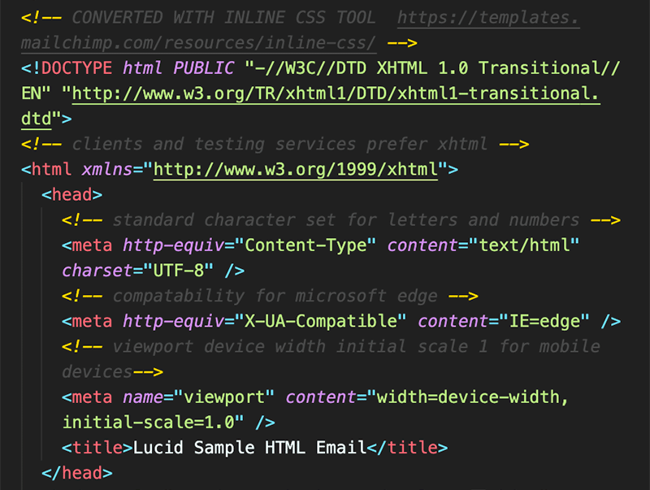
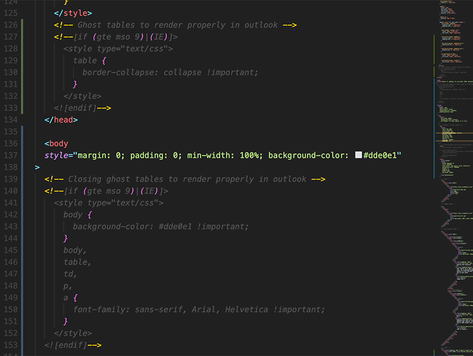
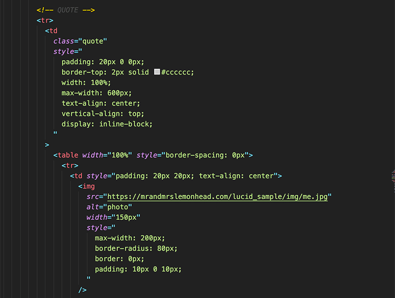

# Responsive HTML email

In this project, I created a responsive HTML email using tables and inline CSS to properly work on most email applications.

## Code Snippets

Using the proper DOCTYPE for email clients and testing services.

Learning how to use Ghost Tables to fix problems in Outlook.

I am use to creating a seperated CSS style file, this was a little different by placing the CSS within HTML body code.

## Technolgies Used

- [HTML](https://developer.mozilla.org/en-US/docs/Web/HTML)
- [CSS](https://developer.mozilla.org/en-US/docs/Web/CSS)

## Deployed Link

- [See Live Site](https://mrandmrslemonhead.com/lucid_sample/)

## Authors

Dexter Valencia

- [Link to Repository Site](https://github.com/itsmedexter/responsive_html_email)
- [Link to Github](https://github.com/itsmedexter)
- [Link to LinkedIn](https://www.linkedin.com/in/dextervalencia/)

## License

This project is licensed under the MIT License
